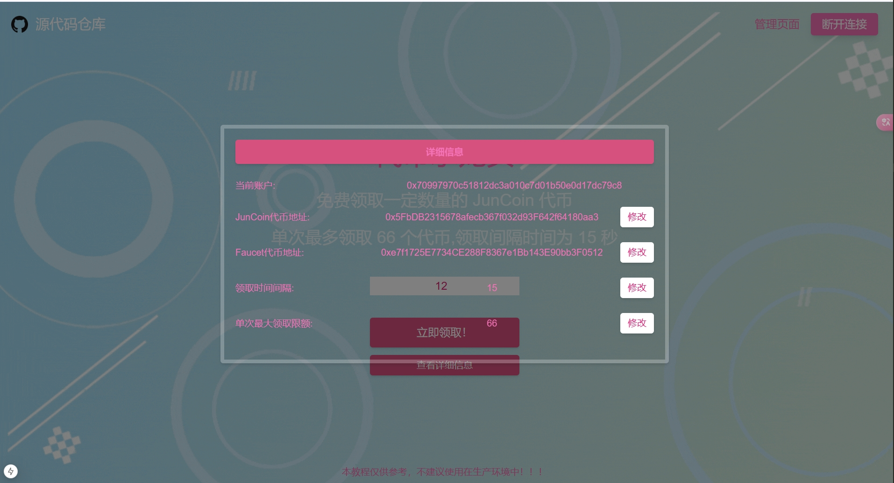
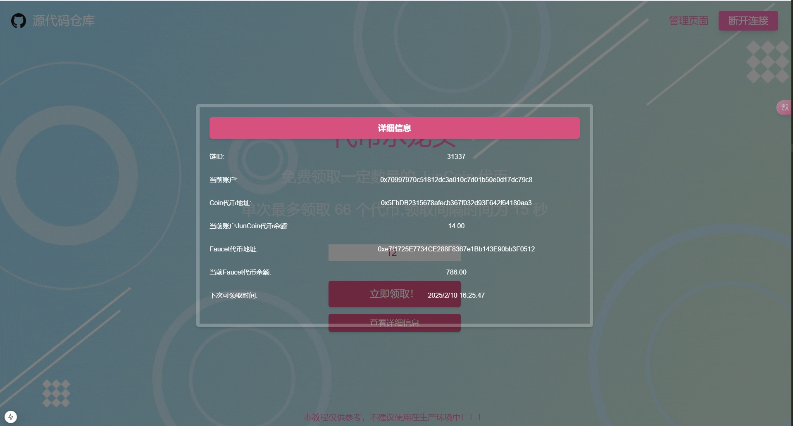

# 02 ERC20 Faucet 
## 项目介绍
这是一个使用 `Nextjs15` 以及 `Foundry` 框架制作的ERC20代币水龙头领取网页

# 文档汇总
- 前端部分
  1. [Nextjs15 官方文档](https://nextjs.org/)
  2. [TailwindCSS 官方文档](https://tailwindcss.com/)
  3. [ethers@6.13.5 官方文档](https://docs.ethers.org/v6/)
   
- 合约部分
  1. [Foundry 官方文档](https://book.getfoundry.sh/)
  2. [Solidity 官方文档](https://docs.soliditylang.org/en/latest/)
  3. [以太坊单位转换器](https://eth-converter.com/)

# 环境配置
## 前端部分
`NextJs`的版本为`15.1.4`
   - 初始化项目的指令: `npx create-next-app@latest`
`ethers.js`的版本为`6.13.5`
   - 安装 `ethers v6`的指令: `npm install ethers@6.13.5`

## 合约部分
`Foundry` 版本为`0.3.0`
   - 初始化项目的指令: `forge init`, 如果项目不为空文件夹这需要加上`--force`,初始化项目时，不进行 Git 提交需要加上`--no-commit`
   - 安装 `OpenZeppelin` 的指令为: `forge install OpenZeppelin/openzeppelin-contracts` 

## 详情教程 请看B站大佬视频  BV1hyw2ejE6a

